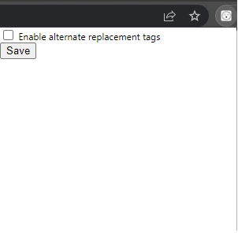

    <h1>
        
    </h1>
    <h2>Awesome Extension</h2>
    

        
        
        
    

## Replaced Emotes

Currently only working in `
` and `<a/>` tags.

- `:blobdance:`
- `:thisisfine:`
- `:catjam:`
- `:surprised-pikachu:`
- `:hype:`
- `:confused_dog:`
- `:suss:`
- `:typingcat:`
- `:amongus:`

### Since v1.0.1
- `:pressf:`
- `:popcat:`
- `:bongocat:`
- `:charmander:`
- `:noted:`
- `:vibebunny:`
- `:discocat:`
- `:kekw:`
- 
### Since v1.0.2
- `:couldyounot:`

### Scheduled for next release
- added optional alternates for some emotes make content on existing sites a bit more fun. This option can be enabled via the popout fun.

